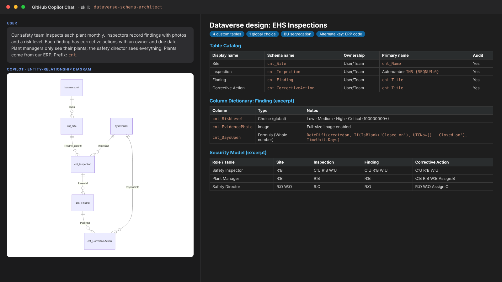

# Dataverse Schema Architect Skill for GitHub Copilot

## Summary

This GitHub Copilot custom skill turns a business process described in plain language into a complete, production-ready **Microsoft Dataverse data model**: tables, columns, global choices, relationships with cascade behavior, alternate keys, security roles, column security and solution/ALM packaging. It produces a design document with a Mermaid ER diagram, column dictionary and security matrix that a Power Platform architect can review **before** anyone builds in the maker portal.

It is aimed at makers, solution architects and consultants who want to stop rebuilding Dataverse models after the first sprint.

## Skill

The full skill definition is in [SKILL.md](./SKILL.md). To use it, copy the [SKILL.md](./SKILL.md) file into your repository at `.github/skills/dataverse-schema-architect/SKILL.md`.

### Trigger Phrases

Say any of these to GitHub Copilot to activate the skill:

- "Design the Dataverse data model for this process"
- "Create the Dataverse tables, columns and relationships for an inspections app"
- "Model this Excel tracker as Dataverse tables with security roles"
- "Which tables, choices and lookups do I need in Dataverse for a Copilot Studio agent?"
- "Diseña el modelo de datos en Dataverse para este proceso" *(works in Spanish too)*

## Description

Most Dataverse projects fail quietly at the data model: free-text columns that should be choices, custom "Users" tables, wrong ownership that cannot be changed later, date columns shifting a day across time zones, and security roles that grant Organization-level access to everyone.

This skill teaches GitHub Copilot to work like a senior Power Platform architect:

- Asks for the process, publisher prefix, personas, volumes, integrations and consumers before designing
- Reuses standard tables (`account`, `contact`, `systemuser`, `team`) instead of duplicating them
- Decides and justifies table type, ownership, primary name column and auditing
- Picks the right column type (Choice vs lookup, Date Only vs User Local, Formula vs Calculated, Currency, File, Autonumber) and flags PII columns
- Defines relationship behavior (Parental, Referential, Restrict Delete, Custom cascade) and native vs explicit N:N
- Adds alternate keys for integration and upsert scenarios, and notes Synapse Link / Fabric when analytics is in scope
- Builds a least-privilege security role matrix with privilege depth, Append/Append To consistency, Entra ID group teams and column security profiles
- Packages everything as a solution with dependency-ordered build checklist, environment variables and connection references
- Self-validates the output against a checklist and lists every assumption as `[ASSUMED]` or `[DECIDE]`

Output sections: Summary · Assumptions & Open Questions · Mermaid ER Diagram · Table Catalog · Column Dictionary · Choices · Relationships · Alternate Keys · Security Model · Solution & ALM · Build Checklist · Risks & Anti-patterns Avoided.

### Versión en español

Este skill convierte un proceso de negocio descrito en lenguaje natural en un modelo de datos completo de **Microsoft Dataverse**, listo para producción: tablas, columnas, choices globales, relaciones con comportamiento en cascada, claves alternativas, roles de seguridad, seguridad a nivel de columna y empaquetado en soluciones. Entrega un documento de diseño con diagrama ER en Mermaid, diccionario de columnas y matriz de seguridad, para revisarlo **antes** de construir en el portal de makers. Si le escribes en español, responde en español (los nombres de esquema se mantienen en inglés, como recomiendan las buenas prácticas).

## Contributors

[Roger Carias](https://github.com/rogerscarias)

## Version history

Version|Date|Comments
-------|----|--------
1.0|October 10, 2026|Initial release

## Instructions

1. Copy [SKILL.md](./SKILL.md) into your repository at `.github/skills/dataverse-schema-architect/SKILL.md`.
2. Open GitHub Copilot Chat in VS Code (Agent mode recommended).
3. Describe your process — paste a paragraph, a meeting transcript, or the columns of your current Excel / SharePoint lists.
4. Answer the questions Copilot asks (publisher prefix, personas, volumes, integrations, consumers).
5. Review the design document, resolve every `[DECIDE]` item, and follow the Build Checklist in the maker portal or with `pac` CLI.

### Customization

- **Naming standards**: change the schema-name convention in Step 2 to match your organization's standard.
- **Security model**: replace the persona examples with your standard role catalog (e.g. Basic User extensions).
- **Compliance**: extend the PII rule in Step 3 with your local data-protection regulation (GDPR, LGPD, Colombia Ley 1581, etc.).
- **Output format**: ask for only the ER diagram, only the security matrix, or a CSV column dictionary.
- **Next steps**: chain it with the [Power Apps Canvas YAML Generator](../powerapps-canvas-yaml-generator/) skill to scaffold screens on top of the model.

## Prerequisites

* [GitHub Copilot](https://github.com/features/copilot)
* [Visual Studio Code](https://code.visualstudio.com/)
* A Microsoft Power Platform environment with Dataverse (to build the resulting design)
* Optional: [Power Platform CLI (`pac`)](https://learn.microsoft.com/power-platform/developer/cli/introduction) for solution export/unpack

## Help

We do not support samples, but this community is always willing to help, and we want to improve these samples. We use GitHub to track issues, which makes it easy for community members to volunteer their time and help resolve issues.

You can try looking at [issues related to this sample](https://github.com/pnp/copilot-prompts/issues?q=label%3A%22sample%3A%20dataverse-schema-architect%22) to see if anybody else is having the same issues.

If you encounter any issues using this sample, [create a new issue](https://github.com/pnp/copilot-prompts/issues/new).

Finally, if you have an idea for improvement, [make a suggestion](https://github.com/pnp/copilot-prompts/issues/new).

## Disclaimer

**THIS CODE IS PROVIDED *AS IS* WITHOUT WARRANTY OF ANY KIND, EITHER EXPRESS OR IMPLIED, INCLUDING ANY IMPLIED WARRANTIES OF FITNESS FOR A PARTICULAR PURPOSE, MERCHANTABILITY, OR NON-INFRINGEMENT.**

---

