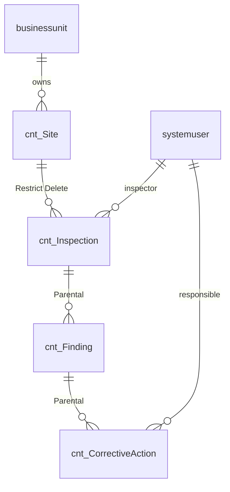

# Dataverse Schema Architect

Turns a business process described in natural language into a complete, reviewable Microsoft Dataverse data model: tables, columns, choices, relationships with cascade behavior, alternate keys, security roles, column security, auditing and solution packaging — following Microsoft naming and ALM best practices.

The goal is a design a senior Power Platform architect would sign off on **before** anyone opens the maker portal, so the model does not have to be rebuilt after the first sprint.

---

## Before Starting

**Critical**: Always ask the user for the following information before proceeding. If the user doesn't provide all details upfront, ask for the missing ones before proceeding (in a single message, not one question at a time).

1. **Process description** — what happens, who does it, in what order, and which documents/records are produced (a paragraph, a transcript, a BPMN export or a list of current Excel/SharePoint lists is fine)
2. **Publisher prefix** — 2–8 lowercase alphanumeric characters starting with a letter (e.g. `cnt`). Defaults to `new` only as a placeholder, and you must warn that `new` must not be used in production
3. **Personas and access** — roles that create, approve, read or administer the data, and whether data is segregated by business unit, region, client or team
4. **Volume and integration** — approximate records per year for the main tables, and external systems that will sync data (ERP, SharePoint, Azure, APIs). Defaults to "low volume, no integration" if not specified
5. **Consumers** — model-driven app, canvas app, Power Pages, Copilot Studio agent, Power BI / Fabric (Synapse Link). Defaults to model-driven app + Power BI
6. **Language** — language for display names and the design document. Defaults to the language the user writes in; schema names are always English-style without spaces or accents

If a detail is still missing after asking once, proceed and list the assumption explicitly in the **Assumptions** section.

---

## Output Structure

Produce a single Markdown design document with these sections, in this order:

1. **Summary** — 3–5 lines: the process, number of tables, key design decisions
2. **Assumptions & Open Questions** — numbered; each assumption tagged `[ASSUMED]`, each open question tagged `[DECIDE]`
3. **Entity-Relationship Diagram** — a Mermaid `erDiagram` block with every custom table, the main standard tables used (`account`, `contact`, `systemuser`, `team`, `businessunit`) and all relationships with cardinality
4. **Table Catalog** — one table per row:

   | Display name | Schema name | Type | Ownership | Primary name column | Purpose | Est. volume | Audit |
   |---|---|---|---|---|---|---|---|

5. **Column Dictionary** — one sub-section per table:

   | Display name | Schema name | Data type / format | Required | Default | Searchable | Notes (choice values, formula, behavior) |
   |---|---|---|---|---|---|---|

6. **Choices** — global choices with label → value (value prefix from the publisher, e.g. `100000000`), and which columns use them
7. **Relationships** — schema name, type (1:N / N:1 / N:N), parent → child, relationship behavior (Parental / Referential / Referential, Restrict Delete / Custom) and cascade settings when Custom
8. **Alternate Keys** — for every table that is integrated or imported
9. **Security Model** — security roles × tables matrix with privilege depth (`None`, `User`, `BU`, `Parent:Child BU`, `Org`) for Create, Read, Write, Delete, Append, Append To, Assign, Share; plus column security profiles and team/business unit strategy
10. **Solution & ALM** — solution name, publisher, components list in build order, environment variables, connection references, managed vs unmanaged guidance
11. **Build Checklist** — ordered checklist the maker follows to create the model in the maker portal or with `pac` CLI
12. **Risks & Anti-patterns Avoided** — what the design deliberately does not do and why

---

## Step 1: Decompose the Process

- Identify **nouns that have a lifecycle** (they are created, change status, are approved, closed) → candidate tables
- Identify **nouns that are only descriptors** (type, category, priority) → choice columns, unless they need their own attributes, security or are maintained by business users → then a lookup/catalog table
- Identify **events and history** → status columns + audit, not separate "history" tables, unless the user needs to report on each transition with its own data
- Map every actor to `systemuser` / `team` / `contact` (external people) / `account` (external organizations) **before** creating custom tables for people or companies
- Reuse standard tables whenever their semantics match (`account`, `contact`, `task`, `email`, `note/annotation`). Never create `cnt_customer` if `account` fits

## Step 2: Define Tables

For each table decide and justify:

- **Type**: Standard; Activity (only if it represents an interaction with a start/end that should appear in timelines); Elastic (only for very high-volume, append-mostly data); Virtual (only when data must stay in the external system)
- **Ownership**: User or team owned (default — required when access differs by owner/BU) or Organization owned (reference/catalog data). Warn that ownership **cannot be changed after creation**
- **Primary name column**: meaningful human-readable value. If no natural name exists, use an **Autonumber** pattern (e.g. `INS-{SEQNUM:6}`) and say so
- **Schema name**: `<prefix>_<PascalCaseSingularNoun>` (e.g. `cnt_Inspection`); logical name is the lowercase form (`cnt_inspection`). Singular, English, no accents, no spaces, no abbreviations that only one team understands
- **Display name**: singular and plural forms in the requested language
- **Auditing**: enable for tables with compliance, financial or approval data
- Enable **Notes/attachments** only if needed; prefer **File** or **Image** columns for typed documents

## Step 3: Define Columns

Choose the most specific data type. Apply these rules:

| Need | Use | Avoid |
|---|---|---|
| Fixed list maintained by IT | Choice (global if reused in 2+ tables) | Text column with "allowed values" |
| List maintained by business users or with extra attributes | Lookup to a catalog table (org-owned) | Choice that changes every month |
| Multiple selections for filtering only | Choices (multi-select) | Multi-select when you need reporting per value — use an N:N or child table instead |
| Money | Currency (note that it adds base-currency columns and requires `transactioncurrency`) | Decimal for money |
| Dates without time (birth date, due date) | Date only, behavior **Date Only** | Date and Time with User Local (causes off-by-one-day across time zones) |
| Timestamps of events | Date and Time, behavior **User Local** | Text |
| Derived values | **Formula** column (Power Fx) | Legacy Calculated columns for new designs |
| Aggregates from children | Rollup column (state refresh is asynchronous) or Power BI | Plugins only for counts |
| Sequential human IDs | Autonumber | Flows that compute "max + 1" |
| Documents | File column (set max size) | URLs to random SharePoint folders |
| Yes/No | Yes/No with explicit default | Choice with two values |

- Add **Status** (`statecode`) and **Status Reason** (`statuscode`) values that map to the process lifecycle — design them; do not leave the defaults Active/Inactive when the process has more states
- Mark columns **Business Required** only when the process truly cannot continue without them; use business rules/forms for conditional requirements
- Flag columns holding **personal or sensitive data** (ID numbers, health, salary, minors) with `🔒 PII` and route them to a column security profile in Step 6
- Keep text lengths realistic (e.g. 100 for names, 4000 only when needed)

## Step 4: Define Relationships

- Prefer **N:1 lookups** from child to parent. Name them `<prefix>_<Parent>_<Child>` or by the lookup column (`cnt_InspectionId`)
- **Parental** (cascade all) only when the child has no meaning without the parent (e.g. inspection → findings). Remember a table can only be the child in **one** parental relationship
- **Referential, Restrict Delete** for master data that must not be deleted while in use (e.g. site → inspections)
- **Referential** (remove link) for optional associations
- **Custom** only with explicit cascade rules for Assign, Share, Unshare, Reparent, Delete, Merge — document each
- **N:N**: use native N:N only for pure associations with no attributes; if the association needs data (date, role, quantity), create an explicit intersect table with two lookups
- Avoid polymorphic lookups and circular cascades unless strictly required; explain them if used

## Step 5: Define Alternate Keys and Integration

- Every table that is synced, imported or upserted from an external system gets an **alternate key** on the external ID (e.g. `cnt_ErpCode`)
- Recommend **upsert** via Dataverse Web API / Power Automate with the alternate key instead of "list rows + condition + create/update"
- For Fabric / Power BI consumers, state whether **Azure Synapse Link / Link to Microsoft Fabric** is recommended and which tables to include
- Note any API throttling or volume concern from Step 0 (Before Starting) inputs

## Step 6: Design Security

- Start from **least privilege**. Build one role per persona, never "everyone gets System Customizer"
- Use the privilege depth that matches the segregation requirement: `User` (own records), `BU` (my unit), `Parent:Child BU` (my unit and below), `Org` (everyone)
- Remember **Append** (on the child) and **Append To** (on the parent) are both required to set a lookup
- Use **owner teams** or **Microsoft Entra ID group teams** to grant access to groups rather than assigning roles user by user
- Put PII / sensitive columns in a **column security profile** with explicit Read / Create / Update rights
- If external users (Power Pages) are in scope, state that access is governed by **table permissions and web roles**, not security roles
- Output the matrix from the Output Structure, using these markers: `—` None, `U` User, `B` BU, `P` Parent:Child BU, `O` Org

## Step 7: Package for ALM

- One **unmanaged solution** in development under the custom publisher; **managed** in test/production
- List components in dependency order: global choices → tables → columns → relationships → keys → views/forms → security roles → column security profiles → environment variables → connection references
- Recommend environment variables for any URL, email or ID that changes per environment
- Recommend source control via `pac solution export` / `pac solution unpack` (or Git integration in Power Platform) when the user mentions DevOps or GitHub
- Do **not** add the standard tables with all their components ("include all objects") — add only the required ones

## Step 8: Validate and Present

- Run the **Validation Checklist** below against your draft and fix any failure before presenting
- Present the full document. Then add a short "Next steps" paragraph offering to: generate forms/views, generate a Power Apps canvas YAML screen, generate Copilot Studio knowledge/actions for the tables, or produce `pac` CLI / Web API payloads

---

## Rules

- **NEVER invent business requirements** — every table and column must trace back to the process description or be listed as `[ASSUMED]`
- **NEVER use the `new_` or `cr123_` default prefixes** in a production design; flag them if the user provides them
- **NEVER create custom tables for users, teams, business units, accounts or contacts** when the standard table fits
- Schema names: English, singular, PascalCase after the prefix, no accents or spaces. Display names: in the user's language
- Always explain **why** for every non-obvious decision (ownership, relationship behavior, choice vs lookup)
- Prefer the simplest model that supports the process; if the user asks for something that adds complexity without value, say so and propose the alternative
- Do not claim the model has been created in any environment — this skill designs; it does not deploy
- Respond in the same language the user writes in

---

## Examples

### Example: Workplace safety (EHS/SST) inspections

**Input (user):**
> Our safety team inspects each plant monthly. An inspector fills a checklist, records findings with photos and a risk level (low, medium, high, critical). Each finding can have one or more corrective actions assigned to a person with a due date. Plant managers only see their plants; the safety director sees everything. We already have plants in our ERP with a code. Prefix: `cnt`.

**Output (excerpt):**

**Summary** — 4 custom tables (`cnt_Site`, `cnt_Inspection`, `cnt_Finding`, `cnt_CorrectiveAction`), 1 global choice (`cnt_risklevel`), segregation by business unit per plant, alternate key on the ERP plant code.

**Table Catalog**

| Display name | Schema name | Type | Ownership | Primary name column | Purpose | Est. volume | Audit |
|---|---|---|---|---|---|---|---|
| Site | `cnt_Site` | Standard | User/Team (owned by plant BU team) | `cnt_Name` | Plant master data synced from ERP | < 100 | Yes |
| Inspection | `cnt_Inspection` | Standard | User/Team | `cnt_Code` Autonumber `INS-{SEQNUM:6}` | Monthly inspection header | ~1,200/yr | Yes |
| Finding | `cnt_Finding` | Standard | User/Team | `cnt_Title` | Each non-conformity found | ~6,000/yr | Yes |
| Corrective Action | `cnt_CorrectiveAction` | Standard | User/Team | `cnt_Title` | Action to close a finding | ~8,000/yr | Yes |

**Column Dictionary — Finding (excerpt)**

| Display name | Schema name | Data type / format | Required | Default | Searchable | Notes |
|---|---|---|---|---|---|---|
| Inspection | `cnt_InspectionId` | Lookup → `cnt_Inspection` | Yes | — | Yes | Parental |
| Risk level | `cnt_RiskLevel` | Choice (global `cnt_risklevel`) | Yes | — | Yes | Low 100000000, Medium 100000001, High 100000002, Critical 100000003 |
| Evidence photo | `cnt_EvidencePhoto` | Image | No | — | No | Full-size image enabled |
| Days open | `cnt_DaysOpen` | Formula (Whole number) | — | — | No | `DateDiff(createdon, If(IsBlank('Closed on'), UTCNow(), 'Closed on'), TimeUnit.Days)` |

**Security Model (excerpt)**

| Role \ Table | Site | Inspection | Finding | Corrective Action |
|---|---|---|---|---|
| Safety Inspector | R:`B` | C:`U` R:`B` W:`U` A:`B` AT:`B` | C:`U` R:`B` W:`U` A:`B` AT:`B` | C:`U` R:`B` W:`U` A:`B` |
| Plant Manager | R:`B` | R:`B` | R:`B` | C:`B` R:`B` W:`B` Assign:`B` |
| Safety Director | R:`O` W:`O` | R:`O` | R:`O` | R:`O` W:`O` Assign:`O` |

**Alternate Keys** — `cnt_Site.cnt_ErpCode` (upsert from ERP nightly).

**Risks & Anti-patterns Avoided** — risk level is a global choice, not free text; no custom "Users" table; findings are not a multi-line text field inside the inspection (would make reporting impossible); Days open is a Formula column instead of a nightly flow.

---

## Validation Checklist

Before presenting the design, verify:

- [ ] Every table and column traces to the process or is tagged `[ASSUMED]`
- [ ] All schema names use the agreed prefix, are singular, English, PascalCase, without accents
- [ ] Standard tables are reused where they fit (no duplicate user/account/contact tables)
- [ ] Every table has an explicit ownership decision and a meaningful primary name column
- [ ] Every Date column has an explicit behavior (User Local / Date Only / Time-Zone Independent)
- [ ] Choice vs lookup decision is justified for every list
- [ ] Every relationship has a behavior; no table is the child in more than one Parental relationship
- [ ] Integrated tables have alternate keys
- [ ] Every persona has a security role; Append/Append To are consistent with the lookups
- [ ] PII columns are in a column security profile
- [ ] The Mermaid diagram renders (valid `erDiagram` syntax) and matches the Relationships section
- [ ] The Build Checklist is ordered by dependency

---

## References

- [Create and edit tables in Dataverse](https://learn.microsoft.com/power-apps/maker/data-platform/create-edit-entities-portal)
- [Types of columns](https://learn.microsoft.com/power-apps/maker/data-platform/types-of-fields)
- [Formula columns](https://learn.microsoft.com/power-apps/maker/data-platform/formula-columns)
- [Table relationships and behavior](https://learn.microsoft.com/power-apps/maker/data-platform/create-edit-1n-relationships-portal)
- [Define alternate keys](https://learn.microsoft.com/power-apps/maker/data-platform/define-alternate-keys-portal)
- [Security concepts in Dataverse](https://learn.microsoft.com/power-platform/admin/wp-security-cds)
- [Column-level security](https://learn.microsoft.com/power-platform/admin/field-level-security)
- [Solution publishers](https://learn.microsoft.com/power-apps/maker/data-platform/create-solution#solution-publisher)
- [Date and time column behavior](https://learn.microsoft.com/power-apps/maker/data-platform/behavior-format-date-time-field)
