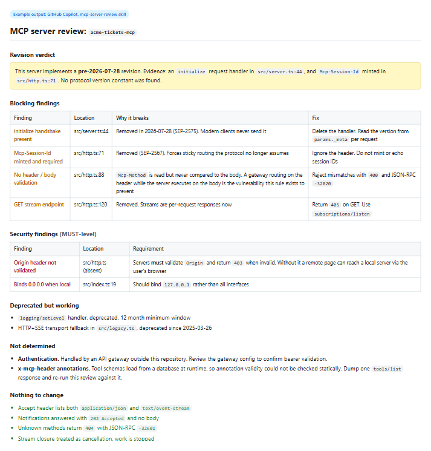

# MCP Server Review Skill for GitHub Copilot

## Summary

This skill teaches GitHub Copilot to review a Model Context Protocol (MCP) server against the **2026-07-28** protocol revision, and to report what is obsolete, what is missing, and what is a security requirement rather than a style preference.

The problem it addresses is specific. Revision 2026-07-28 removed the `initialize` handshake and the `Mcp-Session-Id` header and made MCP stateless. Server code written before that still compiles, still passes its own tests, and still reads correctly in review. It simply speaks a shape modern clients no longer send. There is no error that says "wrong protocol revision", so the symptom usually surfaces as a client that cannot connect for reasons nobody can localise.

## Skill 💡

The full skill definition is in [`SKILL.md`](./SKILL.md). To use it, copy the `SKILL.md` file into your repository's `.github/skills/mcp-server-review/` folder.

### Trigger Phrases

Say any of these to GitHub Copilot to activate the skill:

- "Review this MCP server for spec compliance"
- "Which MCP protocol revision does this server implement?"
- "Audit my MCP server against 2026-07-28"
- "Upgrade this MCP server to the latest protocol revision"
- "My MCP client can't connect to this server, what's wrong?"

## Description ℹ️

The skill walks Copilot through nine steps:

- **Establishing the revision** from evidence in the code rather than from an SDK version number, since SDK majors and protocol revisions move independently
- **Finding removed features still present** - the `initialize` / `initialized` handshake (SEP-2575), `Mcp-Session-Id` (SEP-2567), the GET stream endpoint, `Last-Event-ID` resumability, and server-initiated JSON-RPC requests on SSE
- **Checking the request metadata contract** - the required `MCP-Protocol-Version`, `Mcp-Method` and `Mcp-Name` headers, the exact `_meta` key names, and whether the server actually rejects header and body disagreement with error `-32020`
- **Checking response handling** - both valid response shapes, `202 Accepted` for notifications, stream closure as cancellation
- **Checking the security requirements** separately, because `Origin` validation and localhost binding are MUST-level and are the most commonly missing checks in server code
- **Validating `x-mcp-header` annotations**, including the rule that `number` is not a permitted type and that a conforming client will exclude an entire tool whose annotations are invalid
- **Flagging deprecated features** on the twelve month removal clock
- **Noting what the revision added** - stateless operation, `server/discover`, cacheable list results, Multi Round-Trip Requests

### The design choice that matters

The report has a mandatory **Not determined** section, and the skill is explicit that a check which could not be evaluated must never be folded into "passed". A reviewer reading a clean report has to be able to tell the difference between "this is correct" and "this was not visible from the code provided".

The skill also instructs Copilot to cite the rule behind every finding, to separate MUST from SHOULD as the specification does, and to consult the specification rather than write the protocol from memory - which is the single most likely way to produce a confidently wrong review of a revision this new.

## Prerequisites

* [GitHub Copilot](https://copilot.github.com/)
* [Visual Studio Code](https://code.visualstudio.com/)

## Contributors 👨‍💻

[Elliot Margot](https://github.com/OwnOptic)

## Version history

Version|Date|Comments
-------|----|--------
1.0|August 15, 2026|Initial release, covering protocol revision 2026-07-28

## Help

We do not support samples, but this community is always willing to help, and we want to improve these samples. We use GitHub to track issues, which makes it easy for community members to volunteer their time and help resolve issues.

You can try looking at [issues related to this sample](https://github.com/pnp/copilot-prompts/issues?q=label%3A%22sample%3A%20mcp-server-review%22) to see if anybody else is having the same issues.

If you encounter any issues using this sample, [create a new issue](https://github.com/pnp/copilot-prompts/issues/new).

Finally, if you have an idea for improvement, [make a suggestion](https://github.com/pnp/copilot-prompts/issues/new).

## Disclaimer

**THIS CODE IS PROVIDED *AS IS* WITHOUT WARRANTY OF ANY KIND, EITHER EXPRESS OR IMPLIED, INCLUDING ANY IMPLIED WARRANTIES OF FITNESS FOR A PARTICULAR PURPOSE, MERCHANTABILITY, OR NON-INFRINGEMENT.**

