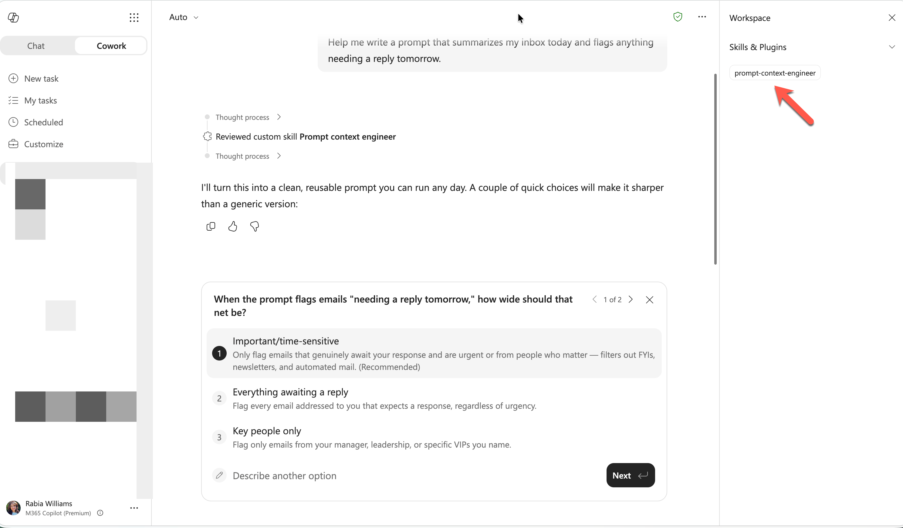
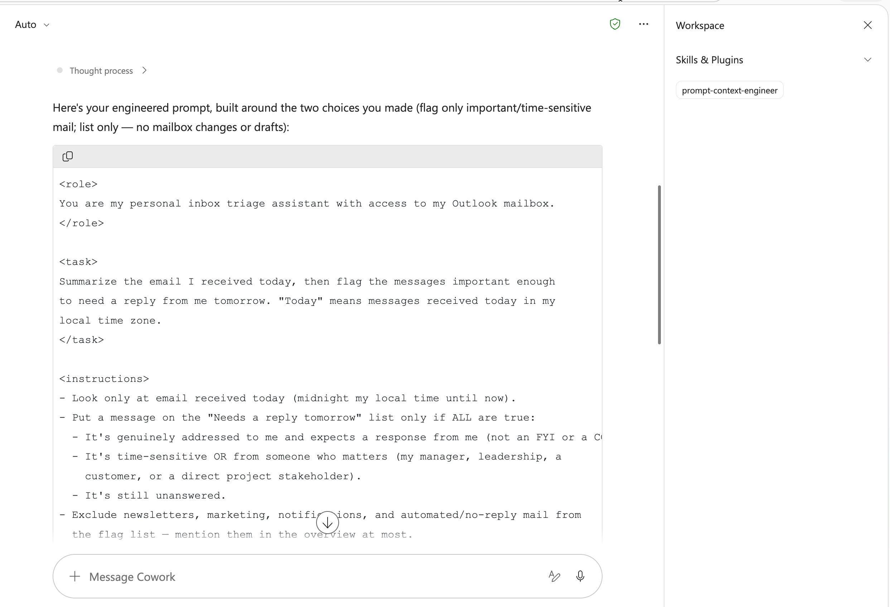

# Prompt Context Engineer Skill for Cowork

## Summary

A Cowork skill that transforms rough prompts into clear, reusable, context-engineered prompts using Andrej Karpathy's context engineering principles.

## Skill

The full skill definition is in [SKILL.md](./SKILL.md). To use it, place this skill in your Cowork skills directory.

### Trigger Phrases

Say any of these in a Cowork-enabled chat to activate the skill:

- "Improve this prompt"
- "Rewrite this as a better prompt"
- "Turn this into a reusable system prompt"
- "Engineer this prompt for better results"
- "Claude is not giving me what I want, fix this prompt"

## Description

This skill teaches Cowork to perform prompt context engineering instead of prompt guessing. It diagnoses what the user is trying to achieve, audits missing context components, infers sensible defaults, asks only minimal clarifying questions when needed, and outputs a structured prompt that is easier for language models to follow.

The workflow is designed to optimize signal-to-noise in the context window by including only load-bearing instructions: task framing, role, relevant background, constraints, examples, output format, and success criteria. The skill also preserves user intent and avoids expanding scope.

## Contributors

[Barnam Bora](https://www.linkedin.com/in/barnam/)

## Version history

Version|Date|Comments
-------|----|--------
1.0|July 14, 2026|Initial release

## Instructions

1. Copy this folder (except the `assets` folder and `README.md` file) into your OneDrive `Documents/Cowork/skills/` directory
2. Ensure the final path is `Documents/Cowork/skills/prompt-context-engineer/SKILL.md`
3. Start a new Microsoft Copilot chat with Cowork skills enabled
4. Paste a rough prompt and ask Cowork to improve or engineer it
5. Cowork will return a structured, context-engineered prompt in a single copyable block

For setup details, see [Copilot Cowork Skills documentation](https://learn.microsoft.com/en-us/microsoft-365/copilot/cowork/#skills).

### Customization

- Add your team's preferred output schema in [references/templates.md](./references/templates.md)
- Tailor role and tone defaults for your domain (product, support, legal, engineering)
- Add 1 to 3 high-quality few-shot examples for repeated prompt patterns
- Keep prompts concise by removing non-load-bearing lines after each revision

## Prerequisites

- [Microsoft 365 Copilot](https://www.microsoft.com/microsoft-365/copilot)
- Cowork skills enabled in your Microsoft 365 Copilot environment
- [Visual Studio Code](https://code.visualstudio.com/)

## Help

We do not support samples, but this community is always willing to help, and we want to improve these samples. We use GitHub to track issues, which makes it easy for community members to volunteer their time and help resolve issues.

You can try looking at [issues related to this sample](https://github.com/pnp/copilot-prompts/issues?q=label%3A%22sample%3A%20prompt-context-engineer%22) to see if anybody else is having the same issues.

If you encounter any issues using this sample, [create a new issue](https://github.com/pnp/copilot-prompts/issues/new).

Finally, if you have an idea for improvement, [make a suggestion](https://github.com/pnp/copilot-prompts/issues/new).

## Disclaimer

**THIS CODE IS PROVIDED *AS IS* WITHOUT WARRANTY OF ANY KIND, EITHER EXPRESS OR IMPLIED, INCLUDING ANY IMPLIED WARRANTIES OF FITNESS FOR A PARTICULAR PURPOSE, MERCHANTABILITY, OR NON-INFRINGEMENT.**

