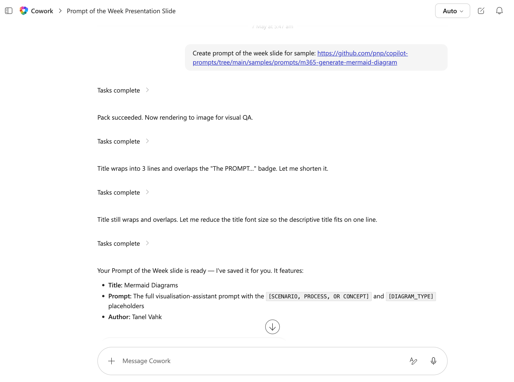

# Prompt of the Week Skill

A Cowork skill that provides a curated "Prompt of the Week" PowerPoint slide, designed to inspire automation and spark new ideas.

## Overview
This skill delivers a weekly prompt designed to spark creativity, learning, or productivity within your team. Each week, a new prompt is featured, encouraging users to explore new ideas, reflect, or take action. Ideal for teams looking to foster engagement and continuous improvement using Microsoft Copilot Cowork.

## How to Use
1. **Copy the Skill**: Drop this folder (except the `assets` folder and `README.md` file) into your Copilot Cowork `skills` directory. For more details, see the [Copilot Cowork Skills documentation](https://learn.microsoft.com/en-us/microsoft-365/copilot/cowork/#skills).
2. **Activate in Copilot**: Follow your organization's process to enable cowork skills in Microsoft Copilot.
3. **Prompt Copilot Cowork**: Use a natural language command to invoke this skill. For example:

	> create prompt of the week from sample https://github.com/pnp/copilot-prompts/tree/main/samples/agent-instructions/childrens-book-recommender

4. **Get Inspired**: Each week, access the latest "Prompt of the Week" directly from Copilot to inspire your work and team discussions or give kudos.

## References
- [Copilot Cowork Skills Documentation](https://learn.microsoft.com/en-us/microsoft-365/copilot/cowork/#skills)

---

