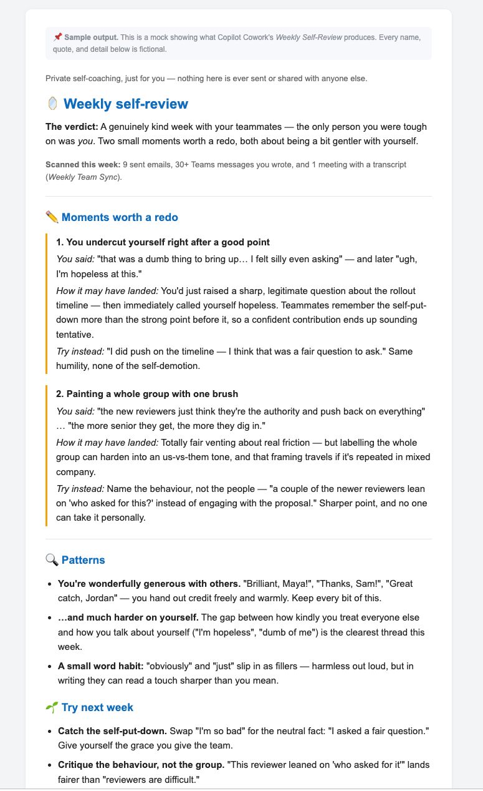

# 🪞 Self-Awareness Review for Microsoft 365 Copilot Cowork

## Summary

A private self-awareness coaching skill that reviews your own Teams meetings, chats, and sent emails over a given week to surface moments where you may have misread social signals or come across as passive-aggressive, curt, sarcastic, or dismissive — returning the exact quote, how it likely landed, and a kinder rewrite.

## Skill 💡

The full skill definition is in [`SKILL.md`](./SKILL.md). This is a Cowork skill for Microsoft 365 Copilot.

### Trigger Phrases

Say any of these to Microsoft 365 Copilot to activate the skill:
- *"Was I out of line this week?"*
- *"Did I come across as passive-aggressive?"*
- *"Did I misread anyone this week?"*
- *"How did I come across?"*
- *"Check my tone this week"*
- *"Was I the difficult one?"*

## Description ℹ️

This skill performs a private self-reflection review by:

1. Resolving the target week (defaults to the current week Mon–Sun)
2. Gathering the user's own outbound communications (sent emails, Teams chats, meeting transcript lines)
3. Scanning for passive-aggressive markers, curtness, sarcasm, or misread social signals
4. For each flagged moment: presenting the exact quote, how it likely landed, and a kinder rewrite
5. Synthesizing patterns and suggesting concrete habits for improvement

The output is always private and inline — never sent, forwarded, or posted. It only analyzes the signed-in user's own words and never evaluates other people.

## Contributors 👨‍💻

[Anthony Shaw](https://github.com/tonybaloney)

## Version history

Version|Date|Comments
-------|----|--------
1.0|August 04, 2026|Initial release

## Instructions 📝

1. Go to the [Cowork Customize page](https://m365.cloud.microsoft/cowork#/customize)
2. Choose **Skills**
3. Upload the [`SKILL.md`](./SKILL.md) file
4. Open Microsoft 365 Copilot
5. Say: *"Was I out of line this week?"*
6. Copilot will review your sent emails, Teams chats, and meeting transcripts for the week and deliver a private self-awareness report

### Customization 🚀

- Adjust the signal categories in Step 3 to focus on specific communication patterns you want to improve
- Modify the output format to include additional coaching elements
- Change the default time window from one week to a different period

## Prerequisites

* [Microsoft 365 Copilot](https://www.microsoft.com/microsoft-365/copilot)
* Microsoft 365 account with access to Teams, Outlook, and meeting transcripts

## Help

We do not support samples, but this community is always willing to help, and we want to improve these samples. We use GitHub to track issues, which makes it easy for community members to volunteer their time and help resolve issues.

You can try looking at [issues related to this sample](https://github.com/pnp/copilot-prompts/issues?q=label%3A%22sample%3A%20self-awareness-review%22) to see if anybody else is having the same issues.

If you encounter any issues using this sample, [create a new issue](https://github.com/pnp/copilot-prompts/issues/new).

Finally, if you have an idea for improvement, [make a suggestion](https://github.com/pnp/copilot-prompts/issues/new).

## Disclaimer

**THIS CODE IS PROVIDED *AS IS* WITHOUT WARRANTY OF ANY KIND, EITHER EXPRESS OR IMPLIED, INCLUDING ANY IMPLIED WARRANTIES OF FITNESS FOR A PARTICULAR PURPOSE, MERCHANTABILITY, OR NON-INFRINGEMENT.**

