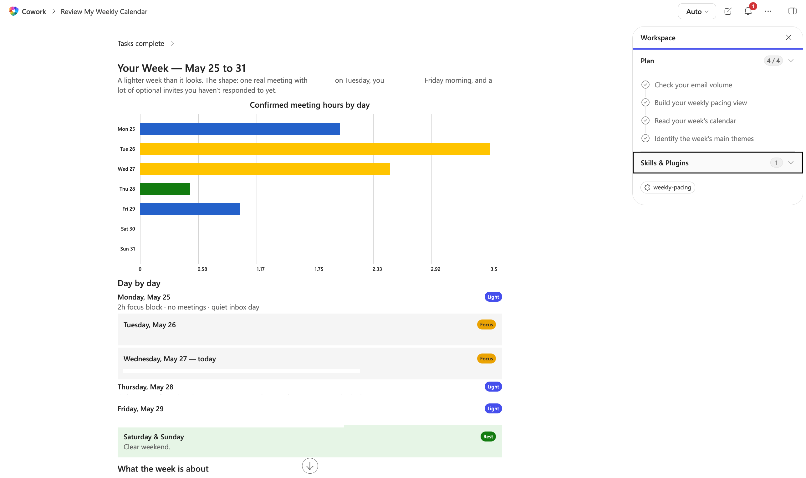

# Weekly Pacing Skill for Cowork

## Summary

Weekly Pacing analyzes upcoming workload signals and presents a calm visual summary of the week. It highlights rest and lighter days first, then identifies focus and heavy days with one gentle recommendation.

## Skill

The full skill definition is in [SKILL.md](./SKILL.md). To use it, place this skill in your Cowork skills directory.

### Trigger Phrases

Say any of these in with Cowork enabled to activate the skill:

- "show my week"
- "is my week busy"
- "which days are heavy"
- "where can I breathe this week"
- "weekly rhythm check"

## Description

This skill resolves the target week, gathers calendar activity, email volume, and semantic project themes, then classifies each day as Rest, Light, Focus, or Heavy. It presents a visual weekly pacing report and a short inline summary that emphasizes reassurance and practical clarity for anxious users.

## Contributors

[rabwill](https://github.com/rabwill)

## Version history

Version|Date|Comments
-------|----|--------
1.0|May 27, 2026|Initial release

## Instructions

1. Download this sample folder and keep [SKILL.md](./SKILL.md) in the weekly-pacing folder structure
2. Place the folder in your OneDrive under Documents/Cowork/skills/weekly-pacing/
3. Start a new chat with Cowork 
4. Say: "show my week"
5. Copilot will ask for any missing details and then perform the task

### Customization

You can tune classification thresholds, adjust trigger phrases, or adapt the tone guidance for your team's communication style while keeping the anxiety-aware guardrails intact.

## Prerequisites

- [Microsoft 365 Copilot](https://www.microsoft.com/microsoft-365/copilot)
- Cowork skills enabled in your Microsoft 365 Copilot environment

## Help

We do not support samples, but this community is always willing to help, and we want to improve these samples. We use GitHub to track issues, which makes it easy for community members to volunteer their time and help resolve issues.

You can try looking at [issues related to this sample](https://github.com/pnp/copilot-prompts/issues?q=label%3A%22sample%3A%20weekly-pacing%22) to see if anybody else is having the same issues.

If you encounter any issues using this sample, [create a new issue](https://github.com/pnp/copilot-prompts/issues/new).

Finally, if you have an idea for improvement, [make a suggestion](https://github.com/pnp/copilot-prompts/issues/new).

## Disclaimer

**THIS CODE IS PROVIDED *AS IS* WITHOUT WARRANTY OF ANY KIND, EITHER EXPRESS OR IMPLIED, INCLUDING ANY IMPLIED WARRANTIES OF FITNESS FOR A PARTICULAR PURPOSE, MERCHANTABILITY, OR NON-INFRINGEMENT.**

